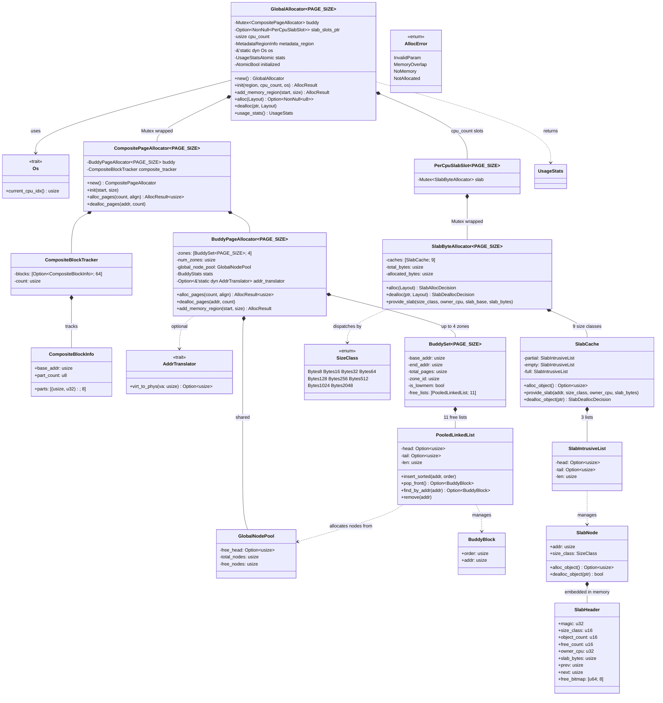
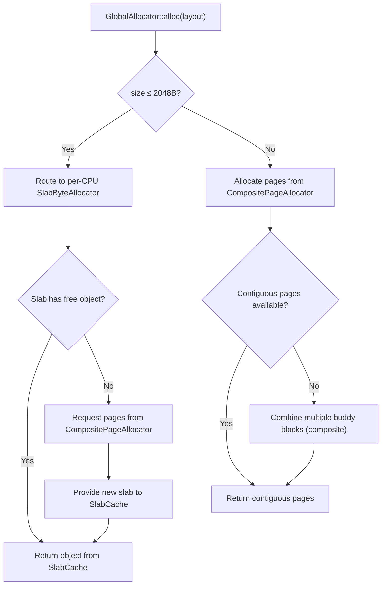

# buddy-slab-allocator

A `no_std` buddy + slab two-level memory allocator designed for kernel and embedded environments.

## Architecture Overview

The allocator employs a classic **two-level** architecture:

1. **Buddy page allocator** — manages physical pages, the shared backend
2. **Slab byte allocator** — manages small objects (≤ 2048 bytes), the frontend
3. **GlobalAllocator** — a multi-core facade that routes allocations to per-CPU slab caches or the buddy backend



### Allocation Flow



## Features

- **Buddy page allocator** — power-of-2 page allocation with splitting and merging
- **Slab byte allocator** — 9 fixed size classes (8B ~ 2048B) for small objects
- **Composite page allocation** — combines non-contiguous buddy blocks for large requests
- **Multi-core support** — per-CPU slab caches with `GlobalAllocator` facade
- **Multi-zone** — up to 4 memory zones with low-memory (DMA32) preference
- **Runtime memory addition** — add memory regions after initialization
- **`no_std`** — suitable for kernel and embedded environments
- **Optional `tracking`** — compile-time statistics gathering
- **Built-in `log`** — structured logging for debugging

## Quick Start

### Add Dependency

```toml
[dependencies]
buddy-slab-allocator = "0.2.0"

# With statistics tracking
buddy-slab-allocator = { version = "0.2.0", features = ["tracking"] }
```

### Using `GlobalAllocator`

The `GlobalAllocator` is the recommended interface. It automatically routes small allocations to per-CPU slab caches and large allocations to the buddy page allocator.

```rust
use buddy_slab_allocator::{GlobalAllocator, OsImpl};
use core::alloc::Layout;

const PAGE_SIZE: usize = 0x1000;

struct DemoOs;
impl OsImpl for DemoOs {
    fn current_cpu_idx(&self) -> usize { 0 }
    fn virt_to_phys(&self, vaddr: usize) -> usize { vaddr }
}

static OS: DemoOs = DemoOs;

let allocator = GlobalAllocator::<PAGE_SIZE>::new();
let region_start = 0x8000_0000 as *mut u8;
let region_size = 16 * 1024 * 1024;
let region = unsafe { core::slice::from_raw_parts_mut(region_start, region_size) };

unsafe {
    allocator.init(region, 1, &OS).unwrap();
}

let layout = Layout::from_size_align(64, 8).unwrap();
let ptr = allocator.alloc(layout).unwrap();
allocator.dealloc(ptr, layout);
```

### Using Buddy and Slab Separately

For lower-level control, use the components directly:

```rust
use buddy_slab_allocator::{
    CompositePageAllocator, SlabAllocDecision, SlabByteAllocator, SlabDeallocDecision,
};
use core::alloc::Layout;

const PAGE_SIZE: usize = 0x1000;
let mut page_alloc = CompositePageAllocator::<PAGE_SIZE>::new();
page_alloc.init(0x8000_0000, 16 * 1024 * 1024);

let mut slab_alloc = SlabByteAllocator::<PAGE_SIZE>::new();
let layout = Layout::from_size_align(64, 8).unwrap();

let ptr = loop {
    match slab_alloc.alloc(layout).unwrap() {
        SlabAllocDecision::Allocated(ptr, _) => break ptr,
        SlabAllocDecision::NeedsRefill {
            size_class,
            page_count,
            slab_bytes,
        } => {
            let slab_base = page_alloc.alloc_pages(page_count, slab_bytes).unwrap();
            slab_alloc
                .provide_slab(size_class, 0, slab_base, slab_bytes)
                .unwrap();
        }
    }
};

if let SlabDeallocDecision::ReleaseSlab {
    slab_base,
    page_count,
    ..
} = slab_alloc.dealloc(ptr, layout)
{
    page_alloc.dealloc_pages(slab_base, page_count);
}
```

## API Reference

### Core Types

- **`GlobalAllocator<PAGE_SIZE>`** — Top-level facade combining page and slab allocation
- **`CompositePageAllocator<PAGE_SIZE>`** — Page allocator with composite block support
- **`BuddyPageAllocator<PAGE_SIZE>`** — Multi-zone buddy page allocator
- **`SlabByteAllocator<PAGE_SIZE>`** — Slab allocator managing 9 size classes

### Traits

- **`Os`** — Provides CPU index for per-CPU slab routing
- **`AddrTranslator`** — Virtual-to-physical address translation for DMA32

### Allocation Decisions

The slab allocator returns decisions rather than directly allocating pages, allowing the caller to manage page allocation:

- **`SlabAllocDecision::Allocated(ptr, size)`** — object allocated successfully
- **`SlabAllocDecision::NeedsRefill { size_class, page_count, slab_bytes }`** — slab needs new pages

- **`SlabDeallocDecision::Done`** — object freed within the slab
- **`SlabDeallocDecision::ReleaseSlab { slab_base, page_count, .. }`** — slab became empty, pages can be released

## Testing & Benchmarking

```bash
# Run tests
cargo test
cargo test --features tracking

# Check benchmarks compile
cargo check --benches

# Run all benchmarks
cargo bench

# Run one benchmark suite
cargo bench --bench buddy_allocator
cargo bench --bench slab_allocator
cargo bench --bench global_allocator
```

Benchmarks are built with `divan`. Detailed benchmark notes are in `benches/README_CN.md`.

## License

Licensed under [Apache-2.0](LICENSE).
