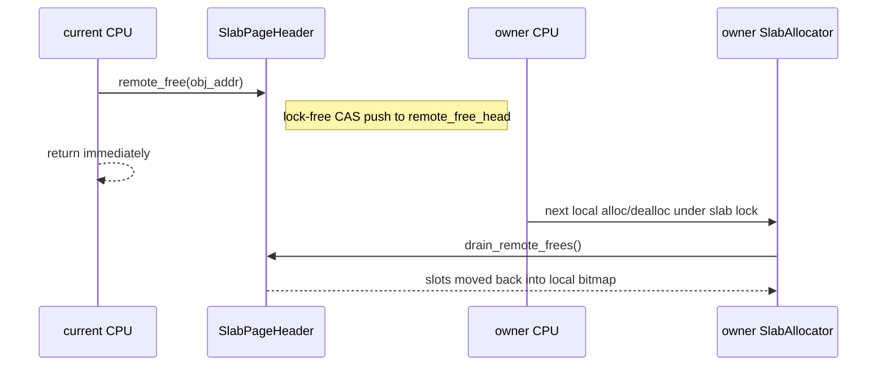

# buddy-slab-allocator

A `no_std` two-level allocator for kernel and embedded environments, combining a buddy page allocator with per-CPU slab allocators.

## Overview

The current implementation is built from three layers:

1. `BuddyAllocator`
   Manages a contiguous virtual heap in page units, with power-of-two splitting and merging.
2. `SlabAllocator`
   Manages small objects up to 2048 bytes with fixed size classes.
3. `GlobalAllocator`
   Combines the two, routing small allocations to per-CPU slab caches and large allocations to buddy pages.

The design details are documented in [docs/design.md](docs/design.md).

## Architecture

```mermaid
flowchart TD
    GA[GlobalAllocator] --> B[SpinMutex<BuddyAllocator>]
    GA --> OS[OsImpl]
    GA --> PCS[per_cpu_slabs: *mut SpinMutex<SlabAllocator>[]]

    B --> PM[PageMeta[]]
    B --> FL[free_lists by order]

    PCS --> SA[SlabAllocator]
    SA --> SC[SlabCache x 9]
    SC --> P[partial]
    SC --> F[full]
    SC --> E[empty]
    SC --> H[SlabPageHeader]
```

### Allocation routing

```mermaid
flowchart TD
    A[GlobalAllocator::alloc(layout)] --> B{size <= 2048 and align <= 2048?}
    B -- Yes --> C[Use current CPU slab allocator]
    C --> D{Allocated from slab?}
    D -- Yes --> E[Return object pointer]
    D -- No --> F[Allocate pages from buddy as a new slab]
    F --> G[add_slab and retry]
    G --> E
    B -- No --> H[Allocate pages directly from buddy]
    H --> I[Return page-backed pointer]
```

### Cross-CPU free path



## Features

- Buddy page allocation with splitting and merging
- Slab allocation for 9 size classes: `8..=2048`
- Per-CPU slab caches
- Lock-free cross-CPU remote frees
- DMA32 / lowmem page allocation via `alloc_pages_lowmem`
- `no_std` friendly
- Built-in `log` integration
- Standalone `BuddyAllocator` and `SlabAllocator` usage

## Add dependency

```toml
[dependencies]
buddy-slab-allocator = "0.2.0"
```

## Using `GlobalAllocator`

```rust
use buddy_slab_allocator::{GlobalAllocator, OsImpl};
use core::alloc::Layout;

const PAGE_SIZE: usize = 0x1000;

struct DemoOs;

impl OsImpl for DemoOs {
    fn current_cpu_idx(&self) -> usize { 0 }
    fn virt_to_phys(&self, vaddr: usize) -> usize { vaddr }
}

static OS: DemoOs = DemoOs;

let allocator = GlobalAllocator::<PAGE_SIZE>::new();
let region_start = 0x8000_0000 as *mut u8;
let region_size = 16 * 1024 * 1024;
let region = unsafe { core::slice::from_raw_parts_mut(region_start, region_size) };

unsafe {
    allocator.init(region, 1, &OS).unwrap();
}

let layout = Layout::from_size_align(64, 8).unwrap();
let ptr = allocator.alloc(layout).unwrap();

unsafe {
    allocator.dealloc(ptr, layout);
}
```

## Using Buddy and Slab separately

For lower-level control, the two building blocks can be used directly.

```rust
use buddy_slab_allocator::{
    BuddyAllocator, SlabAllocResult, SlabAllocator, SlabDeallocResult,
};
use core::alloc::Layout;

const PAGE_SIZE: usize = 0x1000;
const HEAP_SIZE: usize = 16 * 1024 * 1024;

let heap_start = 0x8000_0000usize;
let meta_size = BuddyAllocator::<PAGE_SIZE>::required_meta_size(HEAP_SIZE);
let meta_ptr = 0x9000_0000 as *mut u8;

let mut buddy = BuddyAllocator::<PAGE_SIZE>::new();
unsafe {
    buddy.init(meta_ptr, meta_size, heap_start, HEAP_SIZE, None).unwrap();
}

let mut slab = SlabAllocator::<PAGE_SIZE>::new();
let layout = Layout::from_size_align(64, 8).unwrap();

let ptr = loop {
    match slab.alloc(layout).unwrap() {
        SlabAllocResult::Allocated(ptr) => break ptr,
        SlabAllocResult::NeedsSlab { size_class, pages } => {
            let slab_bytes = pages * PAGE_SIZE;
            let addr = buddy.alloc_pages(pages, slab_bytes).unwrap();
            slab.add_slab(size_class, addr, slab_bytes, 0);
        }
    }
};

match slab.dealloc(ptr, layout) {
    SlabDeallocResult::Done => {}
    SlabDeallocResult::FreeSlab { base, pages } => {
        buddy.dealloc_pages(base, pages);
    }
}
```

## Public API summary

- `GlobalAllocator<PAGE_SIZE>`
  High-level allocator facade that can also implement `GlobalAlloc`.
- `BuddyAllocator<PAGE_SIZE>`
  Standalone page allocator.
- `SlabAllocator<PAGE_SIZE>`
  Standalone slab allocator.
- `SizeClass`
  Fixed object size classes used by slab.
- `SlabAllocResult`
  `Allocated(ptr)` or `NeedsSlab { size_class, pages }`.
- `SlabDeallocResult`
  `Done` or `FreeSlab { base, pages }`.
- `OsImpl`
  Provides `current_cpu_idx()` and `virt_to_phys()` for per-CPU routing and lowmem selection.

## Testing

```bash
# Run normal tests
cargo test

# Run tests serially
cargo test -- --test-threads=1

# Run ignored stress tests
cargo test --test stress_test -- --ignored --nocapture

# Check benchmarks compile
cargo check --benches

# Run benchmarks
cargo bench
```

More test notes are in [tests/README.md](tests/README.md).

## License

Licensed under [Apache-2.0](LICENSE).
